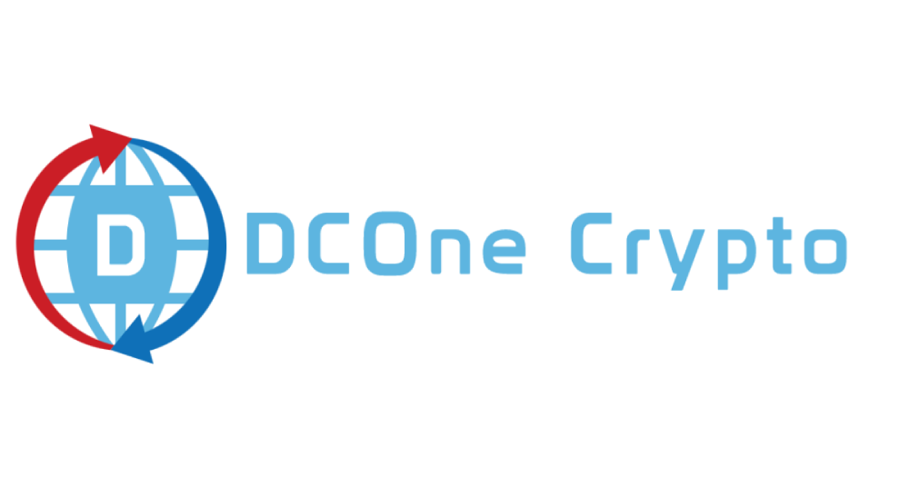
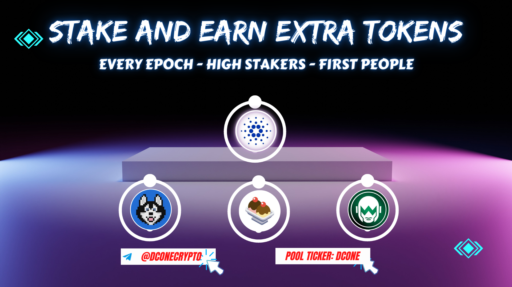

<h1 align="center">

<p>DCOne Crypto Pool</p>
</h1>

## Pool

- Name: DCOne Crypto Pool
- Ticker: DCONE
- Margin: 0%
- Fixed Cost: 340.0₳
- Link: ["https://cexplorer.io/pool/pool1xvaagsvl9prlr20hvg2qv434yss5c88r2ml6n43wcpepxmw85lj","https://cardanoscan.io/pool/333bd4419f2847f1a9f7621406563524214c1ce356ffa9d62ec07213?tab=epochhistory"]

## Rewards check

```bash
  https://dconecrypto.finance/rewards-snapshot.html
```

**UPDATE: August 1, 2023**

_If you stake with us you are eligble for rewards. Minimum requirements are to have at least 500₳ in delegation and to stake more than one full epoch. Currently we have following rewards that are distributed every epoch:_

- EARN SUNDAE - 0.5 Sundae for every 10k₳ bet
- EARN 1M $Hosky tokens per epoch for each delegate

**Extra ADA rewards for "High stakers"**

- Stake >500k₳ and earn extra 300₳ per month
- Minimum requirement is to bet at least 5 full epochs.
- **We have 2 slots for high stakers**

**ADA Bonus for "First 30 People"**
_Minimum requirements are to have at least 500₳ in delegation and to stake more than one full epoch. Currently we have the following rewards:_

- EARN 30 $WRT tokens

## Image


